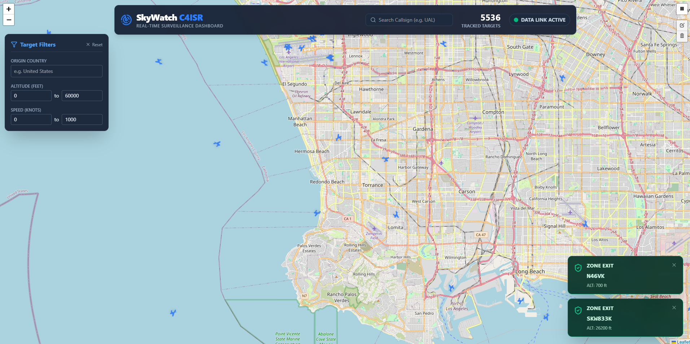

# SkyWatch: Real-Time C4ISR Surveillance Dashboard

SkyWatch is a full-stack, event-driven aircraft surveillance dashboard designed to mirror the architecture of modern defense and aerospace C4ISR (Command, Control, Communications, Computers, Intelligence, Surveillance, and Reconnaissance) systems. 

It ingests live ADS-B telemetry from the OpenSky Network, processes the data stream through an Apache Kafka pipeline, caches live states for ultra-low latency, persists historical tracks, and pushes updates to a React client via WebSockets.

## Architecture & Data Flow

```text
[OpenSky REST API] 
       │ (Polling every 10s)
       ▼
 [Spring Boot Producer] ───> (Raw JSON) ───> [Apache Kafka Broker]
                                                     │
                                                     ▼
                                           [Spring Boot Consumer]
                                           (Data Enrichment & Geofencing)
                                                     │
                             ┌───────────────────────┴───────────────────────┐
                             ▼                                               ▼
             [ Redis (Live State Cache) ]                   [ PostgreSQL (Historical DB) ]
                             │                                               │
                             ▼                                               ▼
             [Spring Boot STOMP Broadcaster]                 [Spring Boot REST Controller]
                             │                                               │
                             ▼ (WebSockets /topic/flights)                   ▼ (HTTP GET /api/flights/history)
                             └───────────────────────┬───────────────────────┘
                                                     ▼
                                        [ React 18 + Leaflet UI ]
```

## Key Features

* **Real-Time Data Streaming:** Bi-directional STOMP WebSocket integration pushes live telemetry to the browser without client-side polling.
* **Geospatial Intelligence (GEOINT):** 
  * Draw dynamic bounding boxes (geofences) on the map. 
  * Backend stream processing compares `t-1` and `t-0` coordinates to detect zone incursions.
  * Instantaneous `ENTER` and `EXIT` WebSocket alerts are dispatched to the UI.
* **Historical Trail Rendering:** REST APIs query PostgreSQL to draw historical flight paths (polylines) on demand.
* **Polyglot Persistence:** Utilizes **Redis** (in-memory) for sub-millisecond reads of the live map state, and **PostgreSQL** (relational) for durable time-series positional history.
* **Declarative CI/CD:** Integrated `Jenkinsfile` for automated multi-stage Docker builds and JUnit testing.

## Technology Stack

**Backend (Event-Driven Microservice)**
* Java 21 & Spring Boot 3
* Apache Kafka (Message Broker)
* Redis (High-speed caching & TTL state management)
* PostgreSQL + Spring Data JPA (Data persistence)
* Spring WebSocket / STOMP

**Frontend (Client Dashboard)**
* React 18 (Vite + TypeScript)
* Tailwind CSS v4 (Styling)
* Leaflet & React-Leaflet (GIS Mapping & Clustering)
* Lucide React (Symbology)

**DevOps & Infrastructure**
* Docker & Docker Compose (Containerization & Networking)
* Jenkins (CI/CD Pipeline)
* Multi-stage `Dockerfile` (Optimized JRE runtime)

## Local Development Setup

### Prerequisites
* [Docker Desktop](https://www.docker.com/products/docker-desktop/) installed and running.
* [Node.js](https://nodejs.org/) installed (for frontend).

### 1. Boot the Backend & Infrastructure
The backend is fully containerized. Open your terminal in the root directory and run:

```powershell
# Build the Spring Boot image and spin up Kafka, Redis, and Postgres
docker compose up --build -d

# Verify all 4 containers are running
docker compose ps
```

### 2. Start the Frontend
Open a new terminal and navigate to the frontend directory:

```powershell
cd frontend
npm install
npm run dev
```
Navigate to `http://localhost:5173` in your browser. Wait ~10 seconds for the first Kafka polling cycle to complete, and the aircraft will populate the map!

## Screenshot


*Live Map tracking of commercial aircrafts*
